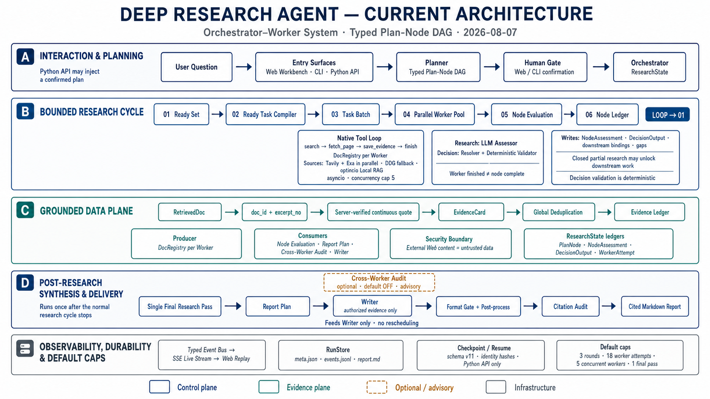

# Deep Research Agent

[](https://github.com/yy2511/deep-research-agent/actions/workflows/container-image.yml)

一个面向开放式问题的研究系统。它先生成带依赖关系和验收条件的研究计划，再并发检索、读取原文、整理证据，最后输出带引用的 Markdown 报告。



## 运行流程

```text
问题
  → Planner（生成 plan-node DAG）
  → 用户确认计划
  → Ready Set / Research Rounds（并发 Worker）
  → Research Assessor / Decision Validator
  → Final Research Pass（至多一次）
  → Report Plan
  → [可选] Cross-Worker Audit
  → Writer（带引用 Markdown）
```

## 实现

- `PlanNode` 记录研究目标、依赖关系和验收条件；Ready Set 只调度依赖已满足的节点。
- Worker 使用原生 tool-calling loop 完成搜索、页面读取和证据保存，并以连续原文作为引用依据。
- research 节点由 Assessor 检查证据是否满足验收条件；decision 节点由 Resolver 生成结果，再由代码校验结构、引用和下游参数。
- 研究结束后生成 Report Plan，Writer 只使用节点已经接受的证据。可选的 Cross-Worker Audit 负责提示跨任务冲突，不改变调度结果。
- 轮次、并发数、任务总数、工具调用、证据数量和总运行时间都有明确上限。
- Web 界面展示计划、任务、证据、节点状态和最终报告；CLI 与 Python API 使用同一套编排代码。

## 快速开始

需要 Python 3.12、[uv](https://docs.astral.sh/uv/) 和 Node.js 22。

```bash
# 安装 Python 依赖
uv sync

# 配置模型和检索服务
cp .env.example .env

# CLI
uv run python -m dra "咖啡对健康有什么影响，每天喝多少合适"

# Web：分别启动后端和前端开发服务器
uv run python -m dra.web
cd web && npm ci && npm run dev
```

后端默认监听 `http://127.0.0.1:8765`，Vite 开发服务器默认监听 `http://127.0.0.1:5173`。运行 `cd web && npm run build` 后，FastAPI 会直接提供 `web/dist/` 中的前端文件。

Web 检索会并发请求 Tavily 与 Exa；两者都失败时尝试 DuckDuckGo。环境变量见 [.env.example](.env.example)。

本地 RAG 是可选能力，会安装 `sentence-transformers` / Torch：

```bash
uv sync --extra local-rag
```

CLI 报告写入 `reports/`。Web 的计划、事件、报告和本机模型配置写入 `DRA_DATA_DIR` 对应目录。这些运行数据不提交到 Git。

## 验证

```bash
# 后端：默认跳过联网和付费用例
uv run pytest

# 仅在明确需要真实 API 验证时运行
uv run pytest --run-live

# 前端
cd web
npm test
npm run lint
npm run build
```

最近一次测试结果和已知限制见 [STATUS.md](STATUS.md)。`review_runs/` 保存经过脱敏的运行记录，可用于检查计划、工具调用、节点状态和报告之间的对应关系。

## 运行入口

| 入口 | 配置来源 | 用途 |
|---|---|---|
| CLI `python -m dra` | `src/dra/__main__.py` 显式构造 | 单次交互式研究 |
| Web `python -m dra.web` | 本机 `runtime_config.json` | 交互式研究与运行回放 |
| Python API | `OrchestratorConfig` / `SubAgentConfig` | 集成、测试与显式覆写 |

三个入口共用研究内核，但分别读取自己的模型配置。

## 项目结构

```text
src/dra/        编排、节点、Worker、证据、持久化与 Web API
web/            React + Vite + TypeScript 工作台
tests/          默认离线的运行时回归测试
review_runs/    脱敏的 Web 运行记录
figures/        架构图
deploy/         容器发布与回滚控制
docs/           检索与部署说明
```

## 技术栈

Python 3.12 · `asyncio` · Pydantic v2 · OpenAI-compatible SDK · Tavily / Exa / DDG · FastAPI · React / Vite / TypeScript · Vitest · Docker Compose

编排层使用 Python `asyncio` 实现，没有引入 LangGraph。
